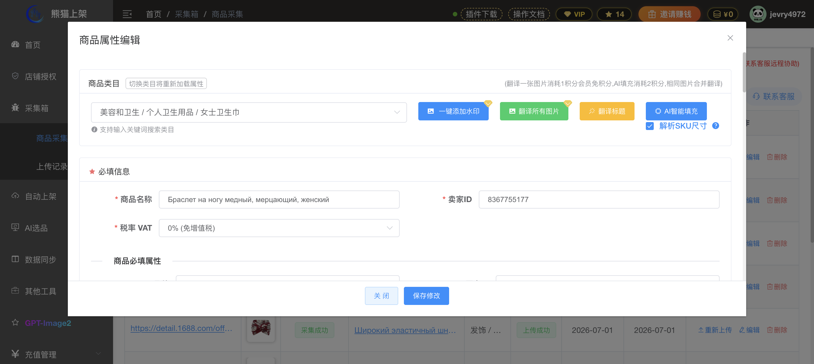
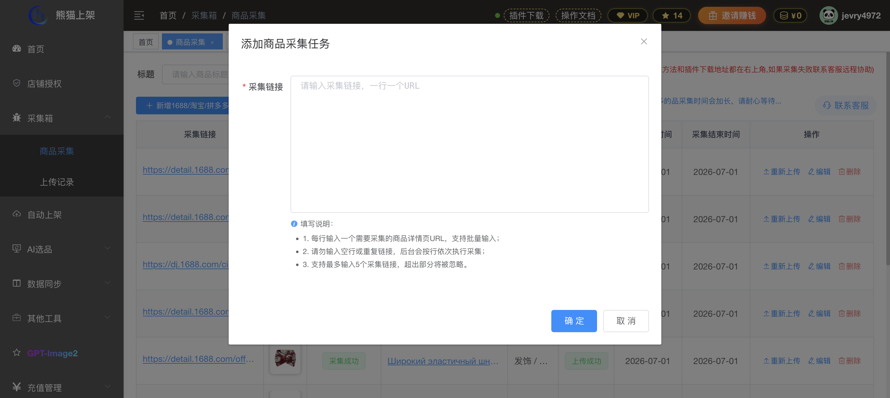
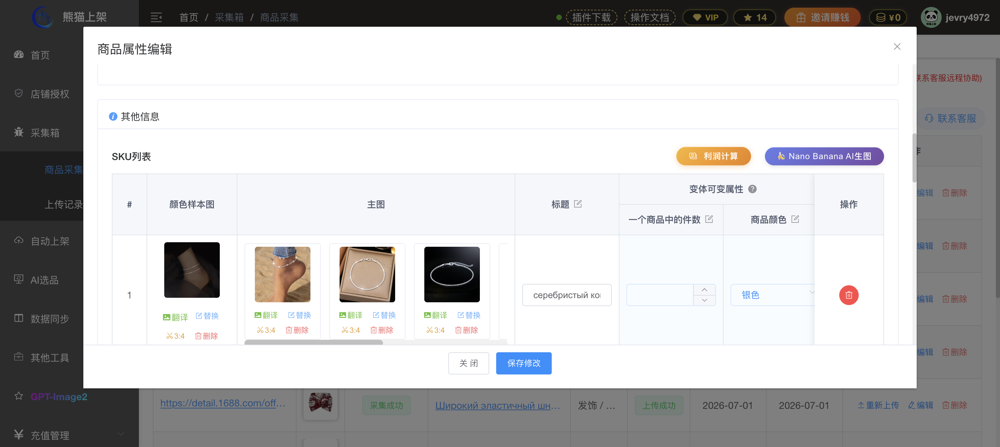
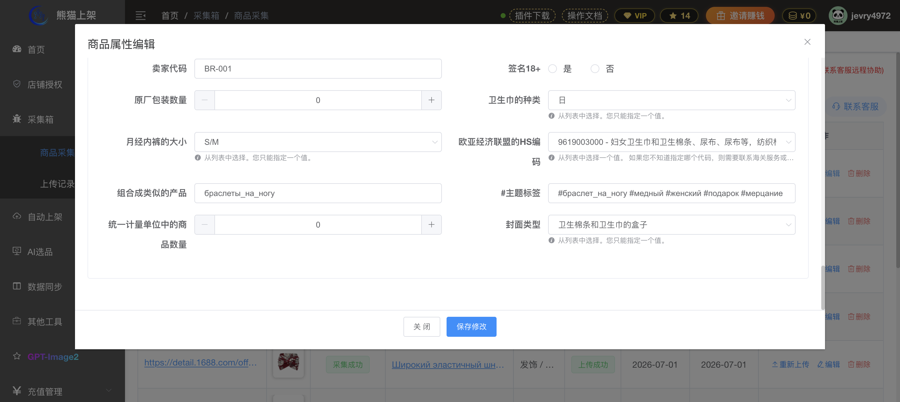
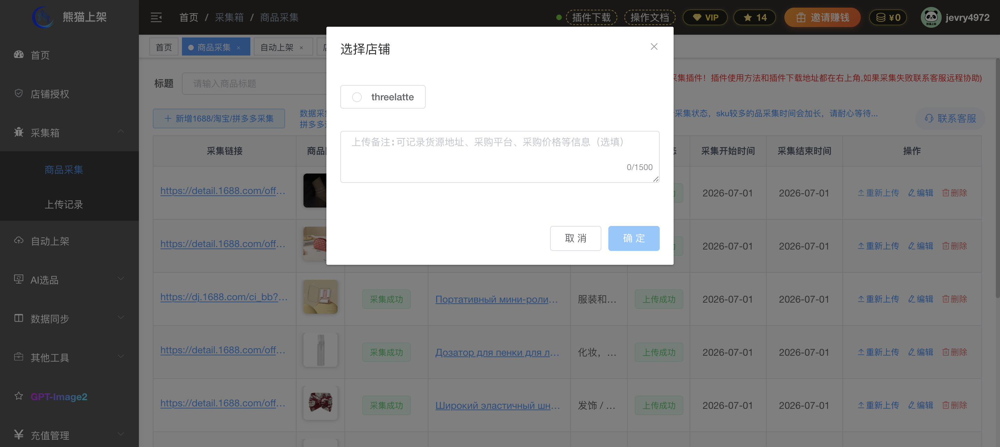

# 熊猫商家 ERP 采集箱交互深扒报告

## 任务执行概况
- **采集箱 URL**: https://system.xiongmaoshangjia.cn/#/collectionbox/task
- **截图数量**: 7 张（涵盖列表、批量粘贴、编辑弹窗各分区、店铺选择）
- **核心模块**: 采集链接管理 -> 商品属性深度编辑 -> 多店铺/单店铺发布

## 1. 采集箱列表页
- **工具栏**: 搜索框（按标题）、新增采集按钮、刷新采集状态。
- **列表项字段**: 采集链接、商品图、采集状态（采集成功/失败）、商品标题、类目、发布状态（上传成功等）、时间戳。
- **操作列**: 重新上传、编辑、删除。

## 2. 批量粘贴入口 (03_paste_dialog.png)
- **按钮**: "新增1688/淘宝/拼多多采集"
- **弹窗交互**: 
  - 支持批量输入 URL，一行一个。
  - 单次最大支持 5 条链接。
  - 限制：不支持直接粘 SKU 或 1688 自动匹配开关（该功能可能在插件侧或编辑页）。

## 3. 编辑弹窗全字段清单 (04/05/06_edit.png)

| 分区 | 字段名称 | 控件类型 | 备注 |
| :--- | :--- | :--- | :--- |
| **基础信息** | 商品类目 | 下拉选择/搜索 | 联动加载后续属性字段 |
| | 商品名称 (Title) | 文本框 | 支持翻译、AI 填充 |
| | 卖家ID | 文本框 | 默认自动生成 |
| | 税率 VAT | 下拉选择 | 默认 0% |
| **类目属性** | 品牌 | 下拉/搜索 | 必填 |
| | 原产国 | 下拉选择 | |
| | 类型 / 型号名称 | 文本框 | 影响合并上架逻辑 |
| | 制造商 | 文本框 | |
| **SKU 变体** | 颜色样本图/主图 | 图片组 | 支持批量翻译、替换、裁剪 |
| | 变体标题 | 文本框 | 例如 "银色-套装" |
| | 变体属性 (颜色/尺寸) | 文本框/选择 | 一个商品中的件数、商品颜色等 |
| | 价格/重量/体积 | 数字输入 | 含重量单位、尺寸单位 (cm) |
| **图片与视频** | 详情图 | 图片列表 | 支持翻译、排序、删除 |
| | 商品视频 | 上传按钮 | |
| **其他/高级** | 简介 (Marketing text) | 长文本 | |
| | 卖家代码 (SKU Code) | 文本框 | |
| | HS 编码 (HS Code) | 下拉选择 | 针对出口/物流需求 |
| | 主题标签 (Hashtags) | 文本框 | 支持 # 引导的多个标签 |
| | 签名 18+ | 单选框 | |
| **底部操作** | 关 闭 / 保存修改 | 按钮 | 无"直接送入上架"按钮，需在列表操作 |

## 4. 关键交互回答
- **批量粘贴入口**: 位于列表顶部显眼位置，点击后弹出文本域，支持纯 URL 粘贴。
- **送入上架逻辑**: 在列表页点击「重新上传」（或未上传时的「送入上架」），弹出「选择店铺」弹窗。目前 UI 显示为**单选（Radio）**模式，且可填写「上传备注」。
- **AI 智能填充**: 弹窗顶部设有「AI智能填充」和「翻译标题」按钮。点击后会根据 1688 源数据解析并自动填充：类目、品牌（默认无品牌）、标题（翻译后）、SKU 属性、重量体积、HS 编码等。

## 附件（截图）
1. 列表顶部：
2. 列表底部：
3. 批量粘贴弹窗：
4. 编辑弹窗顶部：
5. 编辑弹窗中部(SKU)：
6. 编辑弹窗底部：
7. 店铺选择弹窗：
